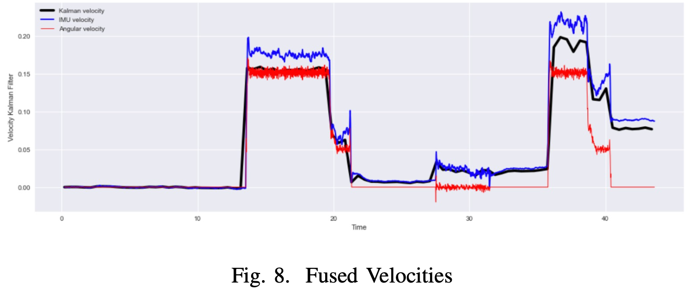
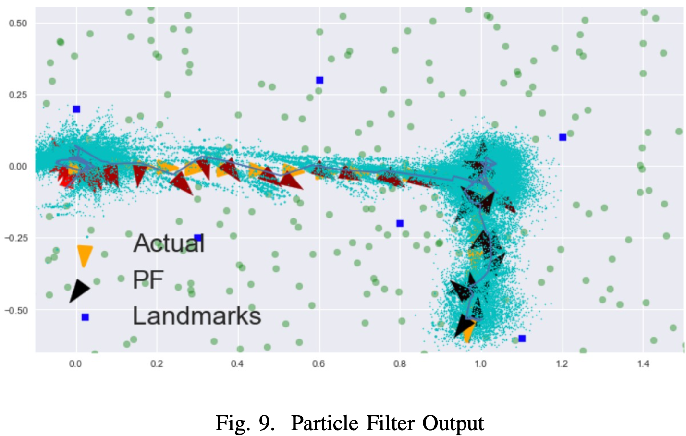

# Localization_ROS2_iCreateRobot
Data Fusion Architecture - Localization Problem with ROS2 and iCreate robot

## Problem statement
This project aims to create a localization system using bayesian statistics: Particle Filter and Kalman Filter. The localisation software should be created in python and implementing bayesian interference for the sensor system of the iCreate3 robot. 

## Hypothesis
Using the sensor data from the internal measuring usint (imu) and the wheel encoders should allow the computation of position and orientation estimates. This can be used in combination with a particle filter to estimate the position of the robot. The robots existing odometry can be used to check the validity of the implemented localisation system.

## Main part
Extract data and calculation of the velocity(from imu, encoders and fused in Kalman Filter) leads to this result:

As a result we can see that Encoder Velocity is more stable and consistent. IMU velocity - while times goes the error is growing. The fused velocity that shows more flexible and adaptive pattern.

Getting all the calculation together and applying in Particle Filter:

## Conclusion
The created jupyter notebook file presents a method to use bayesian probability and data fusion to calculate and predict the localization of a create3 robot. The data from relevant sensors was successfully extracted and displayed. The data from the IMU and the wheel encoders was successfully fused into a position estimate, and the particle filter was successfully applied to generate a localization for the robot based on generated landmark data. The particle filter compares the generated particles to the readings from the existing odometry (TF) and the results show a very realistic prediction, proving the applied concepts.
